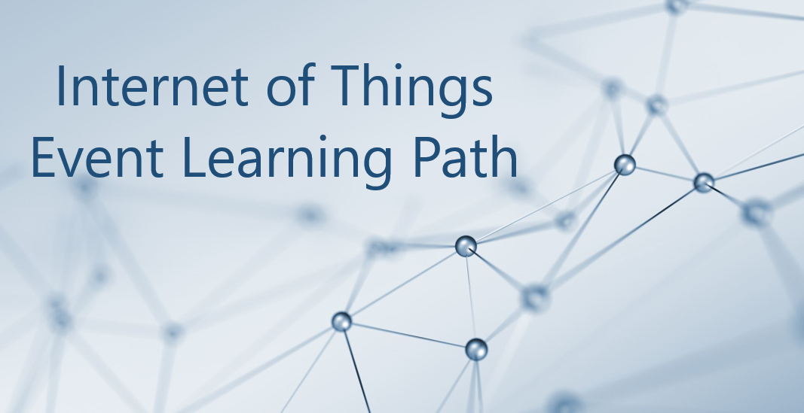

# Internet of Things Event Learning Path



The Internet of Things Event Learning Path is designed for Solution Architects, Business Decision Makers, and Development teams that are interested in building IoT Solutions with Azure Services.  The content is comprised of 5 video based modules that approach topics ranging from IoT device connectivity, IoT data communication strategies, use of artificial intelligence at the edge, data processing considerations for IoT data, and IoT solutioning based on the [Azure IoT reference architecture](https://docs.microsoft.com/en-us/azure/architecture/reference-architectures/iot?WT.mc_id=sciot-video-cxa).  

Each session includes a curated selection of associated modules from [Microsoft Learn](http://microsoft.com/learn?WT.mc_id=sciot-video-cxa) that can provide an interactive learning experience for the topics covered and may also contribute toward preparedness for the official [AZ-220 IoT Developer Certification](https://docs.microsoft.com/en-us/learn/certifications/exams/az-220?WT.mc_id=sciot-certification-cxa). 

This content may be reused as-is across partner, field, and third party events or modified to suit custom audiences. The video resources and presentation decks are open-source and can be found within the associated module's folder in this repository.  

To pull down a local copy of all included slide decks and video presentations, ensure that you have installed [git](https://git-scm.com/downloads), then clone this repo with:

```
git clone https://github.com/microsoft/Internet-of-Things-Event-Learning-Path.git
```

If you are interested in sharing or viewing the content right away, we have hosted the recordings on the [IoT Developer YouTube](https://www.youtube.com/c/microsoft-iot-developers) where they can be viewed on-demand in a curated [Internet of Things - Event Learning Path Playlist](https://aka.ms/iotlp/playlist).  

## Modules

### [**IOT10**: Connecting Your Physical Environment to a Digital World – A Roadmap to IoT Solutioning](./iot10/README.md)

[TODO: Add Abstract]

### [**IOT20**: Deciphering Data – Optimizing Data Communication to Maximize Your ROI](./iot20/README.md)

[TODO: Add Abstract]

### [**IOT30**: Adding Intelligence – Unlocking New Insights with AI & Machine Learning​](./iot30/README.md)

[TODO: Add Abstract]

### [**IOT40**: Big Data 2.0 IoT as your New Operational Data Source](./iot40/README.md)

A large part of value provided from IoT deployments comes from data. However, getting this data into the existing data landscape is often overlooked. In this session, we will start by introducing what are the existing Big Data Solutions that can be part of your data landscape. We will then look at how you can easily ingest IoT Data within traditional BI systems like [Data warehouses](https://docs.microsoft.com/azure/architecture/data-guide/relational-data/data-warehousing/?WT.mc_id=sciot-video-cxa) or in [Big Data](https://docs.microsoft.com/azure/architecture/data-guide/big-data/?WT.mc_id=sciot-video-cxa) stores like data lakes. When our data is ingested, we see how your data analysts can gain new insights on your existing data by augmenting your [PowerBI](https://docs.microsoft.com/en-us/power-bi/?WT.mc_id=sciot-video-cxa) reports with IoT Data. Looking back at historical data with a new angle is a common scenario. Finally, we'll see how to run real-time analytics on IoT Data to power real time dashboards or take actions with [Azure Stream Analytics](https://docs.microsoft.com/azure/architecture/reference-architectures/data/stream-processing-stream-analytics?WT.mc_id=sciot-video-cxa) and Logic Apps. By the end of the presentation, you'll have an understanding of all the related data components of the [IoT reference architecture](https://docs.microsoft.com/azure/architecture/reference-architectures/iot?WT.mc_id=sciot-video-cxa).


### [**IOT50**: Get to Solutioning - Strategy & Best Practices when Mapping Designs from Edge to Cloud](./iot50/README.md)

In this session we will explore strategies for secure IoT device connectivity in real-world edge environments, specifically how use of the [Azure IoT Edge Gateway](https://docs.microsoft.com/en-us/azure/iot-edge/iot-edge-as-gateway?WT.mc_id=sciot-video-cxa) can accommodate offline, intermittent, legacy environments by means of Gateway configuration patterns.  We will then look at implementations of Artificial Intelligence at the Edge in a variety of business verticals, by adapting a common [IoT reference architecture](https://docs.microsoft.com/en-us/azure/architecture/reference-architectures/iot?WT.mc_id=sciot-video-cxa) to accommodate specific business needs.  Finally, we will conclude with techniques for implementing artificial intelligence at the edge to support an [Intelligent Video Analytics solution](http://aka.ms/iot50/intelligentvideo), by walking through a project which integrates Azure IoT Edge with an [NVIDIA DeepStream SDK module](https://azuremarketplace.microsoft.com/en-us/marketplace/apps/nvidia.deepstream-iot?WT.mc_id=sciot-video-cxa) and a custom object detection model built using [CustomVision.AI](https://www.customvision.ai/?WT.mc_id=sciot-video-cxa) to create an end-to-end solution that allows for visualization of object detection telemetry in Azure services like [Time Series Insights](https://docs.microsoft.com/en-us/azure/time-series-insights/?WT.mc_id=sciot-video-cxa) and [PowerBI](https://docs.microsoft.com/en-us/power-bi/?WT.mc_id=sciot-video-cxa).

## Contributing

This project welcomes contributions and suggestions.  Most contributions require you to agree to a
Contributor License Agreement (CLA) declaring that you have the right to, and actually do, grant us
the rights to use your contribution. For details, visit https://cla.opensource.microsoft.com.

When you submit a pull request, a CLA bot will automatically determine whether you need to provide
a CLA and decorate the PR appropriately (e.g., status check, comment). Simply follow the instructions
provided by the bot. You will only need to do this once across all repos using our CLA.

This project has adopted the [Microsoft Open Source Code of Conduct](https://opensource.microsoft.com/codeofconduct/).
For more information see the [Code of Conduct FAQ](https://opensource.microsoft.com/codeofconduct/faq/) or
contact [opencode@microsoft.com](mailto:opencode@microsoft.com) with any additional questions or comments.

## Legal Notices

Microsoft and any contributors grant you a license to the Microsoft documentation and other content
in this repository under the [Creative Commons Attribution 4.0 International Public License](https://creativecommons.org/licenses/by/4.0/legalcode),
see the [LICENSE](LICENSE) file, and grant you a license to any code in the repository under the [MIT License](https://opensource.org/licenses/MIT), see the
[LICENSE-CODE](LICENSE-CODE) file.

Microsoft, Windows, Microsoft Azure and/or other Microsoft products and services referenced in the documentation
may be either trademarks or registered trademarks of Microsoft in the United States and/or other countries.
The licenses for this project do not grant you rights to use any Microsoft names, logos, or trademarks.
Microsoft's general trademark guidelines can be found at http://go.microsoft.com/fwlink/?LinkID=254653.

Privacy information can be found at https://privacy.microsoft.com/en-us/

Microsoft and any contributors reserve all other rights, whether under their respective copyrights, patents,
or trademarks, whether by implication, estoppel or otherwise.
